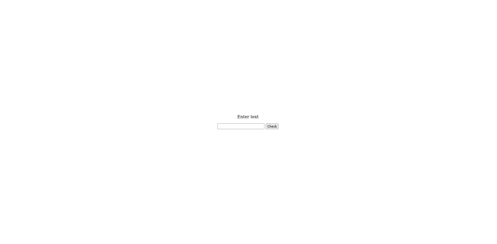
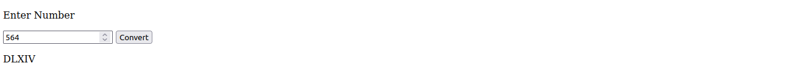
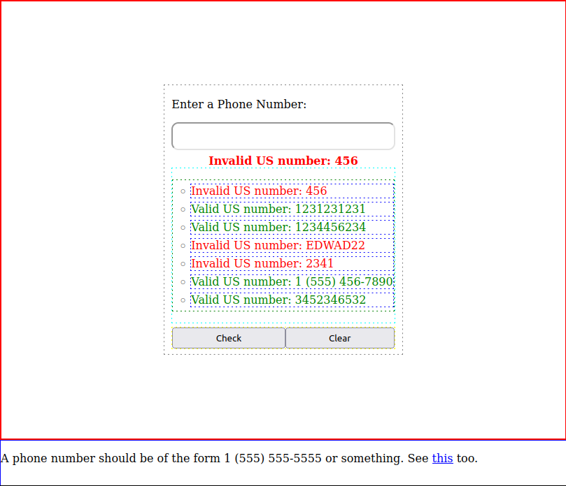

# Projects for JavaScript Algorithms and Data Structures - FreeCodeCamp

Project 1: [PalindromeChecker](./PalindromeChecker/)

Project 2: [RomanNumeralConverter](./RomanNumeralConverter/)

Project 3: [TelephoneNumValidator](./TelephoneNumValidator/)

